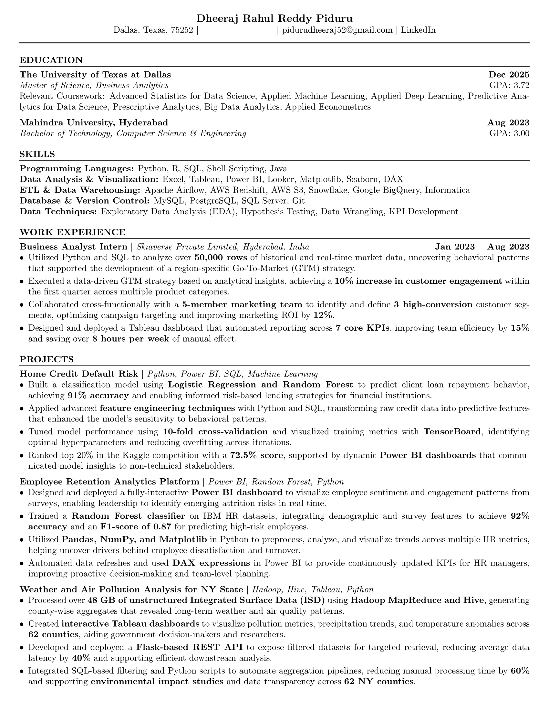

# About Me       

I am Dheeraj Rahul Reddy Piduru, a Master's student in **Business Analytics & AI** at the University of Texas at Dallas, graduating in December 2025.

I have a strong passion for data science, machine learning, and transforming data into actionable insights. My background includes internship experience in business analytics and infrastructure services, with hands-on exposure to building dashboards, predictive models, and automating workflows.

## Technical Skills

- **Programming Languages:** Python, SQL, R, C  
- **Tools & Frameworks:** Scikit-learn, TensorFlow, Keras, Airflow, Databricks, Power BI, Tableau  
- **Cloud & Databases:** AWS, Azure, MongoDB, MySQL, Snowflake  
- **Other:** Excel, Alteryx, Git, Agile, SAP

## Interests

- Applied Deep Learning and Computer Vision  
- Time Series Forecasting and Predictive Modeling  
- Model Interpretability and Responsible AI  
- Data-Driven Decision Making in Business Analytics  
- Process Optimization and Automation  
- Cloud-Based Data Engineering (Azure, Databricks)  
- Esports Analytics and Community Engagement  
- Visualization and Storytelling with BI Tools (Power BI, Tableau)

## Resume

## Contact

- Email: pidurudheeraj52@gmail.com  
- LinkedIn: https://www.linkedin.com/in/dheerajrahulreddypiduru/  

Let's connect and collaborate on meaningful projects.

